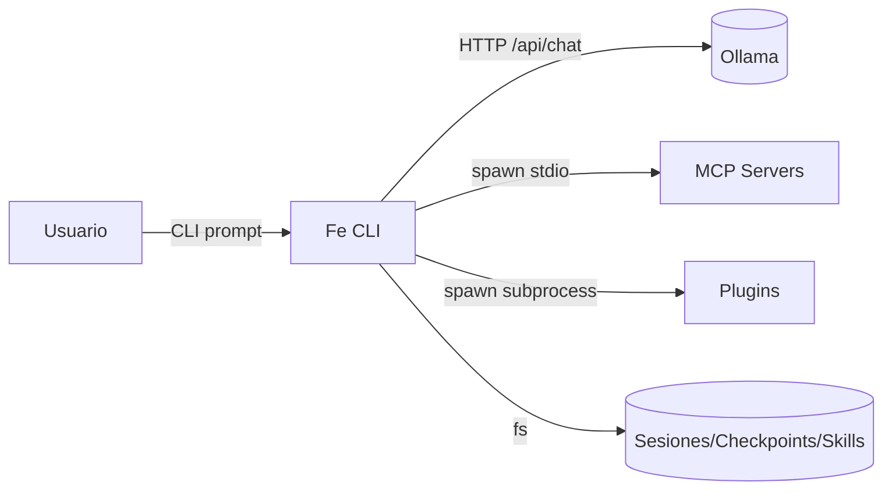
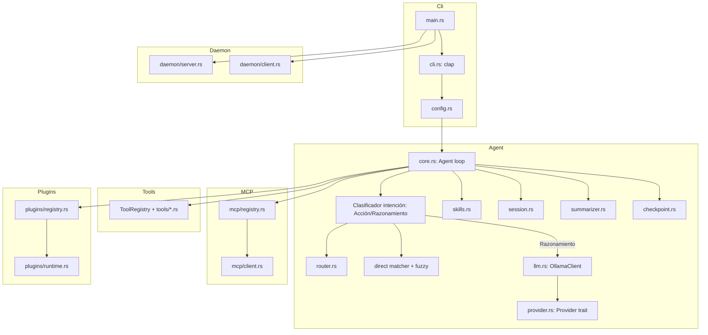

# Fe — Arquitectura

> Documento SAQI `A-project-architecture` · v1.2.0 · Stack, C4, flujos, contratos, decisiones.

## 1. Stack

| Capa | Tecnología | Rol |
|------|-----------|-----|
| CLI | `clap` 4.5 (+ `clap_complete`) | Parseo de argumentos, flags y subcomandos, completions shell |
| Async I/O | `tokio` (full), `tokio-stream` | Runtime async, subprocess, streaming |
| HTTP | `reqwest` 0.12 (json/stream/rustls) | Cliente HTTP hacia Ollama API |
| Serialización | `serde`, `serde_json`, `toml`, `toml_edit` | Config, JSON-RPC, schemas |
| Logging | `tracing`, `tracing-subscriber` | Trazas estructuradas |
| UI CLI | `console`, `indicatif`, `crossterm` | Spinners, formato de salida |
| Matching | `similar` | Fuzzy string matching (skills / intenciones) |
| Ficheros | `walkdir`, `ignore`, `globset`, `regex` | Traversal, búsquedas, patrones |

---

## 2. Diagrama C4 Nivel 1 (Contexto)



---

## 3. Diagrama C4 Nivel 2 (Contenedores)



---

## 4. Regla de dependencia

```
cli (main.rs) → agent (core.rs) → router/direct/llm → provider → Ollama
                                  ↘ tools / mcp / plugins / session
```

- La **interfaz del agente** (`Agent`) es el punto único de entrada desde CLI.
- `Provider` es un **trait (puerto)**; `OllamaProvider` es una implementación (adaptador).
- `ToolRegistry` centraliza el dispatch de tools y admite adaptadores MCP/plugin (`McpToolWrapper`, `PluginToolWrapper`).
- Config se resuelve por precedencia: **defaults < config.toml < env vars < flags**.

---

## 5. Flujo de una petición

```mermaid
sequenceDiagram
    participant U as Usuario
    participant C as core.rs (run)
    participant I as Clasificador intención
    participant R as Reglas + Fuzzy
    participant A as Modelo local (razonamiento)
    participant S as Sesión/Resumen
    U->>C: fe "actualiza repositorios" / "¿qué es SOLID?"
    C->>I: clasificar(prompt)
    alt Acción
        I->>R: match → comando; si destructivo → confirmar → ejecutar
        R-->>C: salida (sin IA)
    else Razonamiento
        I->>A: route → qwen2.5-coder:3b (chat o loop tools)
        A-->>C: respuesta
    end
    C->>S: guardar turno + resumen
    C-->>U: resultado
```

### Detalle del flujo Acción (sin IA)
```
1. Clasificar prompt → Acción
2. Reglas declarativas → comando real (plantilla con parámetros)
3. ¿coincide? → yes → (¿destructivo? → confirmar [y/N]) → ejecutar
4. no → fuzzy matching sobre intenciones conocidas (umbral alto)
      → acierta → (confirmar si destructivo) → ejecutar
5. no → avisar "sin regla para esta acción", NO usar IA
```

### Detalle del flujo Razonamiento (con IA)
```
1. Clasificar prompt → Razonamiento
2. Seleccionar modelo: qwen2.5-coder:3b
3. Cargar skills relevantes + historial sesión
4. Si el modelo soporta tools → loop ReAct (agent loop); si no → chat simple
5. Responder + guardar turno + resumir cada N turns
---

## 6. Árbol de componentes (src/)

| Módulo | Responsabilidad |
|--------|-----------------|
| `main.rs` | Inicialización, parseo CLI, enrutado a agent/daemon/mcp/plugins |
| `cli.rs` | Definición de subcomandos y flags con `clap` |
| `config.rs` | Carga y merge de configuración |
| `agent/core.rs` | Loop principal del agente; clasifica **Acción vs Razonamiento** |
| `agent/intent.rs` | Clasificador de intención (Acción/Razonamiento) |
| `agent/direct_matcher.rs` | Reglas declarativas + fuzzy matching (acciones sin IA) |
| `agent/direct_executor.rs` | Ejecución de comandos directos + templates |
| `agent/router.rs` | Selección de modelo (`select()` → (model, SkillKind)); `supports_tools()` |
| `agent/provider.rs` | `trait Provider` + `OllamaProvider` (puerto/adaptador) |
| `agent/llm.rs` | `OllamaClient` — wrapper sobre `Arc<dyn Provider>` |
| `agent/skills.rs` | `SkillsLoader`, `SkillKind`, matcher por dominio |
| `agent/session.rs` | Sesiones persistentes en markdown |
| `agent/summarizer.rs` | Resumen cada N turns con modelo local |
| `agent/checkpoint.rs` | Checkpoint system (contexto >80% → auto-pause/save) |
| `agent/tools/*.rs` | 10 tools: bash, read, write, edit, glob, grep, task, webfetch, websearch, mkdir |
| `agent/templates.rs` | Generadores multi-lenguaje × tipo de app |
| `utils/confirm.rs` | Confirmación interactiva + detección de destructivos |
| `utils/spinner.rs` | Spinner durante LLM streaming |
| `utils/tokens.rs` | Estimación de tokens |
| `mcp/` | Cliente MCP stdio (registry, client, types) |
| `plugins/` | Sistema de plugins (manifest, loader, registry, runtime) |
| `daemon/` | Modo daemon (server, protocol, handler, client) |
| `e2e_tests.rs` | Tests de integración |

---

## 7. Contratos principales (trait / struct clave)

```rust
// Puerto de LLM (adaptador)
pub trait Provider: Send + Sync {
    fn name(&self) -> &str;
    fn supports_tools(&self) -> bool;
    fn supports_reasoning(&self) -> bool;
    fn max_context(&self) -> u32;
    async fn chat(&self, model: &str, messages: &[Message], tools: &[Value],
                  spinner_done: Option<&AtomicBool>) -> Result<ChatResult>;
    async fn list_models(&self) -> Result<Vec<String>>;
}

// Clasificador de intención
pub enum Intent { Action, Reasoning }
pub struct IntentClassifier;

// Regla declarativa de acción (direct_matcher)
pub struct CommandRule {
    pub intent: String,
    pub pattern: regex::Regex,
    pub command: String,        // plantilla, {param} sustituidos
    pub destructive: bool,
}

// Resultado de match directo
pub struct DirectMatch {
    pub description: String,
    pub command: String,
    pub is_destructive: bool,
}
```

### Inyección de Core Services (DI)

| Trait | Responsabilidad |
|-------|-----------------|
| `ToolsService` | get/list/register/execute tools + schemas |
| `ProvidersService` | get/list/register providers + default |
| `CacheService` | get/set/delete/clear con TTL |
| `SecurityService` | confirm_destructive / is_destructive / sanitize_command |

---

## 8. Modelo de datos (Config)

```rust
pub struct Config {
    pub ollama: OllamaConfig,   // host, timeout_secs, max_retries, keep_alive_secs
    pub models: ModelsConfig,   // complex, simple, reasoning, summarizer
    pub agent: AgentConfig,     // confirm_tools, batch_mode, summarize_every_n_turns, ...
    pub tools: ToolsConfig,     // bash_timeout_secs, max_output_lines, allow_destructive
    pub paths: PathsConfig,     // sessions_dir, skills_dir, plugins_dir, checkpoints_dir
    pub shell: ShellConfig,     // generate_completions, shells
    pub mcp: McpConfig,         // enabled, servers
}
```

> El slot de modelo por defecto apunta a **`qwen2.5-coder:3b`** (local, razonamiento + actions sin IA vía reglas).

---

## 9. Security / Threat model (resumen)

| Riesgo | Mitigación |
|--------|-----------|
| Ejecución de comando destructivo | Confirmación explícita `[y/N]` en acciones destructivas; allowlist/denylist |
| Alucinación del LLM ejecutando comandos | **Las acciones nunca pasan por IA**; solo razonamiento |
| Prompt malicioso inyectado | Las acciones se resuelven por reglas declarativas, no por instrucciones del modelo |
| Inyección en output del shell | `sh_quote()` en sustitución de parámetros |
| Contexto desbordado | Checkpoint system (>80%) + resúmenes |
| Exposición a servicios externos | Solo Ollama local; MCP/plugins deshabilitables |

---

## 10. Patrones y anti-patrones

**Patrones**: Provider (puerto/adaptador), Service Layer (Core Services), DI manual, Result handling con `anyhow`, ToolRegistry + adaptadores (MCP/plugin), Checkpoint context manager, Spec-Driven (`A-sdd`).

**Anti-patrones prohibidos**: dejar que la IA decida acciones, ejecutar comandos destructivos sin confirmar, config hardcodeada, tools acopladas a un provider específico, prompts que inviten al modelo a ejecutar shell.

---

## 11. Referencias

- [`AGENT.md`](AGENT.md) — comportamiento del agente (Acción vs Razonamiento).
- [`docs/SAQI.md`](docs/SAQI.md) — marco metodológico.
- [`docs/SDD.md`](docs/SDD.md) — desarrollo dirigido por especificación.

---

## 12. Changelog

### v1.2.0 — 2026-09-08
- Reescrito en formato SAQI (`A-project-architecture`).
- Añadido clasificador de intención (Acción/Razonamiento) y flujos detallados.
- Modelo por defecto `qwen2.5-coder:3b`.
- C4, contratos, threat model y patrones/anti-patrones.

### v1.1.0 — previo
- Capas, componentes, flujo de petición, dependencias, modelo de datos.
```