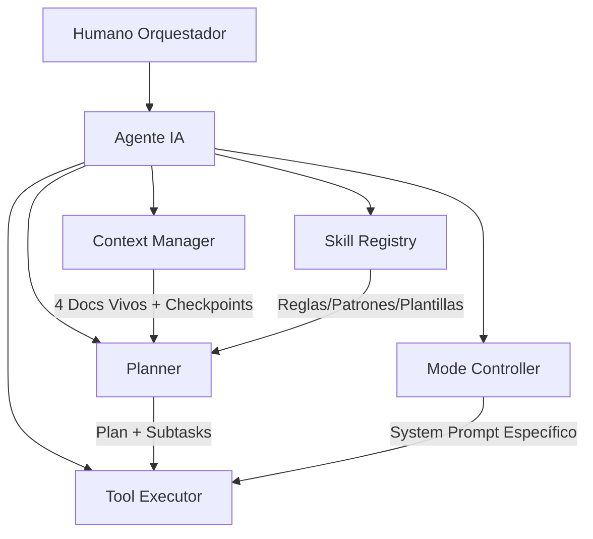

# SAQI — Skills Agentic Quality Iteration

> Documento de metodología SAQI · v1.0.0 · Marco iterativo de mejora de calidad guiado por agentes IA.

## 1. Qué es SAQI

**SAQI** (por sus siglas en inglés **Skills Agentic Quality Iteration**) es el marco metodológico de referencia de este entorno de trabajo. Combina tres pilares en un ciclo iterativo:

| Pilar | Significado | Rol en el ciclo |
|-------|-------------|-----------------|
| **Skills** | Reglas, patrones y plantillas gobernadas y versionadas (SKILL.md) | Proporcionan el *cómo* hacer cada cosa con calidad |
| **Agentic** | Agentes IA que operan en un **loop autónomo** (Plan → Act → Reflect) | Ejecutan el trabajo, resuelven fallos y consultan al humano en los gates |
| **Quality Iteration** | Iteraciones cortas con **gates de calidad** y mejora continua | Validan cada iteración y aprenden para la siguiente |

**Principio rector**: *la iteración no termina hasta que se pasa el gate de calidad; el sistema mejora con cada iteración.*

SAQI es transversal: define la arquitectura de los agentes (`D-Agente-IA`), la gestión del contexto (`A-context-manager`), el desarrollo dirigido por especificación (`A-sdd`) y las reglas de testing/arquitectura/calidad.

---

## 2. Arquitectura del agente SAQI

El agente SAQI se descompone en **5 componentes** (fuente: `D-Agente-IA` v2.0.0 / SAQI-006):

| Componente | Responsabilidad | Skill relacionada |
|------------|-----------------|-------------------|
| **Planner** | Descomponer el objetivo en subtareas ordenadas, estimar tokens, seleccionar herramientas | `D-prompt-engineering` (CoT) |
| **Context Manager** | Monitorear contexto (tokens 70%/80%), checkpointing, re-hidratación, 4 docs vivos | `A-context-manager` |
| **Skill Registry** | Cargar skills version-locked, validar conflictos, proveer reglas/patrones/plantillas | SAQI-003 gobernanza |
| **Tool Executor** | Ejecutar tools (fs, shell, grep, test_runner, ...), timeouts/retries, output estructurado | — |
| **Mode Controller** | Cambiar system prompt + tools + skills según el modo (Builder/Tester/Adversarial/Analyst/Documenter) | `D-prompt-engineering` |



---

## 3. Loop de ejecución (ReAct + Plan-Act-Reflect)

El agente opera en un bucle de 3 momentos por subtarea: **Plan → Act → Reflect**, con verificación final.

```python
async def agent_loop(objective: str, mode: Mode, context: ProjectContext):
    # 1. PLAN
    plan = await planner.decompose(objective, context, mode.skills)

    # 2. EXECUTE (por subtarea)
    for subtask in plan.subtasks:
        if context.tokens_pct > 0.80:
            await context_manager.checkpoint()        # hard checkpoint
        elif context.tokens_pct > 0.70:
            await context_manager.preventive_summary() # resumen preventivo

        result = await tool_executor.run(subtask, mode.system_prompt,
                                         context.get_relevant_docs(), mode.tools)

        # Reflect (self-correction)
        if not result.success:
            reflection = await reflect_on_failure(subtask, result, context)
            if reflection.should_retry:
                continue  # reintentar con ajuste
            return AgentResult.failed(reflection.reason)

        context.add_result(subtask, result)

    # 3. VERIFY
    verification = await verify_completion(objective, context)
    return AgentResult.success(verification)
```

### 3.1 Estados del loop

| Estado | Acción | Timeout |
|--------|--------|---------|
| `PLANNING` | Planner genera plan | 30s |
| `EXECUTING` | Tool Executor ejecutando tool | 120s/tool |
| `REFLECTING` | Auto-evaluación del resultado | 10s |
| `CHECKPOINTING` | Protocolo Context Manager | 30s |
| `WAITING_HUMAN` | Gate humano (Fases 2, 7, 11, 14) | ∞ |
| `ERROR_RECOVERY` | Recuperación de fallos (ver §4) | 3 reintentos |

---

## 4. Recuperación ante fallos (Loop Recovery)

| Fallo | Detección | Recuperación |
|-------|-----------|--------------|
| **Tool timeout** | `tool_executor` > 120s | Matar proceso, reintentar con timeout ×2, degradar herramienta |
| **Tool error (crash)** | Excepción no capturada | Log estructurado, 1 reintento con parámetros seguros, escalar a humano |
| **Alucinación LLM** | Output no valida schema / contradice skills | Self-correction: *"Tu respuesta viola la regla X. Corrige."* (máx. 2) |
| **Context overflow** | Tokens > 80% sin checkpoint | Forzar checkpoint (`A-context-manager`) |
| **Conflicto de skills** | Skill Registry detecta reglas contradictorias | Alertar al humano, pausar, resolver manualmente |
| **Mode mismatch** | Herramienta no permitida en el modo actual | Rechazar tool, sugerir el modo correcto |
---

## 5. Gates humanos obligatorios (SAQI-005)

| Fase | Decisión | Roles requeridos |
|------|----------|------------------|
| 1 Plan | Aprobar plan/backlog | PO, TL |
| 2 Architect | Aprobar ADRs | Architect, TL |
| 3 Skill Selection | Aprobar skills/versiones | TL |
| 4 Build | Code review crítico | TL, Security |
| 7 Break | **Gate Release** — firma QA | QA Lead |
| 8 Diagnose | Validar causa raíz | TL, QA |
| 11 Verify | Sign-off release | PO, TL, QA Lead |
| 14 Improve Skills | Aprobar cambios de skills | Skill Governor |

---

## 6. Optimización por tamaño de modelo

Relevante para `fe`, que opera con un **modelo local 3B**:

| Capacidad | Modelo Grande (70B+) | Modelo Local (3B-7B) |
|-----------|----------------------|----------------------|
| **Planning** | Complejo multi-paso | Descomponer en microtareas atómicas; human-in-the-loop para arquitectura |
| **Context Window** | 128K+ tokens | Checkpointing agresivo (60%/75%); resúmenes más frecuentes |
| **Tool Use** | Nativo, fiable | Few-shot obligatorio (3-5 ejemplos); validación estricta de output |
| **Structured Output** | JSON mode nativo | Regex parsing + repair loop; preferir Markdown estructurado |
| **CoT** | Interno (thinking tokens) | Explícito en output: `## Reasoning` / `## Action` |
| **Skill Loading** | Todas activas | Carga lazy: solo skills de la fase actual; offload skills D a humano |
| **QA adversarial** | Agente modo atacante creativo | Humano lidera la fase 7; el agente ejecuta scripts automatizados |

---

## 7. Métricas de observabilidad

| Métrica | Definición | Target |
|---------|-----------|--------|
| `planning_accuracy` | Subtareas completadas sin replan / Total | > 85% |
| `tool_success_rate` | Tools exitosos / Total invocaciones | > 95% |
| `self_correction_rate` | Auto-correcciones / Fallos detectados | > 70% |
| `human_intervention_rate` | Gates humanos + escalaciones / Iteración | < 10 |
| `context_checkpoint_frequency` | Checkpoints / Iteración | 3-6 |
| `tokens_per_subtask` | Tokens consumidos / Subtarea | < 15K configurable |
| `mode_switch_latency` | Tiempo de cambio de modo | < 5s |

---

## 8. Documentos vivos (SAQI-013 / A-context-manager)

Los "4 docs vivos" que el Context Manager mantiene y re-hidrata en cada iteración:

| Documento | Contenido | Cuándo se actualiza |
|-----------|-----------|---------------------|
| `ARCHITECTURE.md` | Stack, C4, flujos, contratos, decisiones | Fase 2 / cambios arquitectónicos |
| `AGENT.md` | Comportamiento y límites del agente | Cambios de política del agente |
| `CONTEXT.md` | Estado vivo del proyecto + spec activa | Fase 1 (Plan) y Fase 13 (Learn) |
| `docs/specs/SPEC-*.md` | Especificaciones (contrato de verdad, SDD) | Fase 1 / cambios aprobados |

---

## 9. Aplicación de SAQI al proyecto `fe`

- **`fe` actúa como un agente SAQI** (ver `AGENT.md`): loop ReAct con Plan → Act → Reflect, Context Manager (checkpoint system, resúmenes), Skill Registry (skills cargadas desde `~/.config/opencode/skills/`), Tool Executor (10+ tools nativas + MCP + plugins).
- **Optimización para modelo local (3B)**: `fe` usa `qwen2.5-coder:3b`, con few-shot, output validado y checkpointing agresivo.
- **Gates humanos**: el agente **siempre confirma acciones destructivas** y pide aprobación en decisiones; la IA solo se usa para **razonamiento**, no para acciones.
- Referencias a skills SAQI aplicadas: `A-sdd` (spec-first), `A-context-manager` (checkpoints), `A-project-architecture` (este doc), `A-testing` (pirámide L1-L4), `D-Agente-IA` (arquitectura del agente).

---

## 10. Changelog

### v1.0.0 — 2026-09-08
- Definición de SAQI como **Skills Agentic Quality Iteration**.
- Arquitectura del agente (5 componentes), loop ReAct + Plan-Act-Reflect, recuperación de fallos.
- Gates humanos, optimización por tamaño de modelo, métricas y documentos vivos.
- Sección de aplicación al proyecto `fe`.
| **Bucle infinito** | Misma subtarea > 3 intentos | Escalar al humano con diagnóstico |